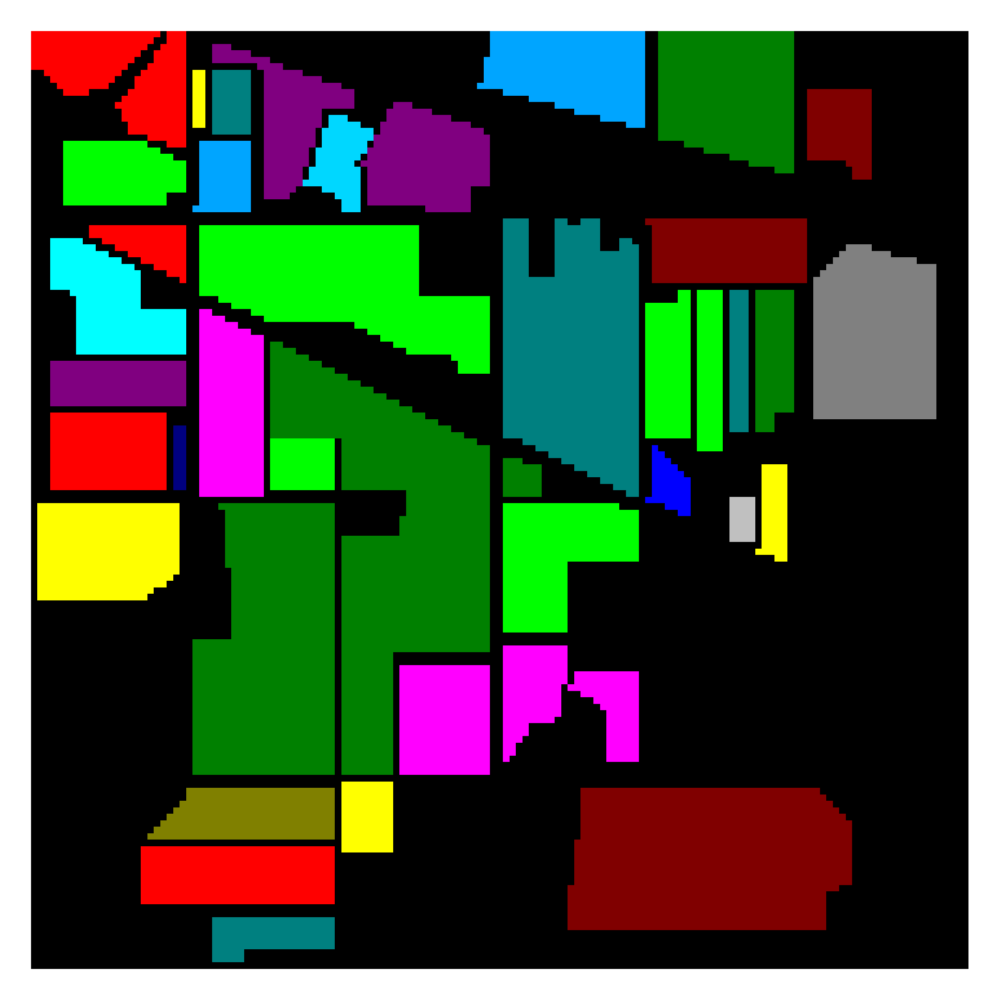
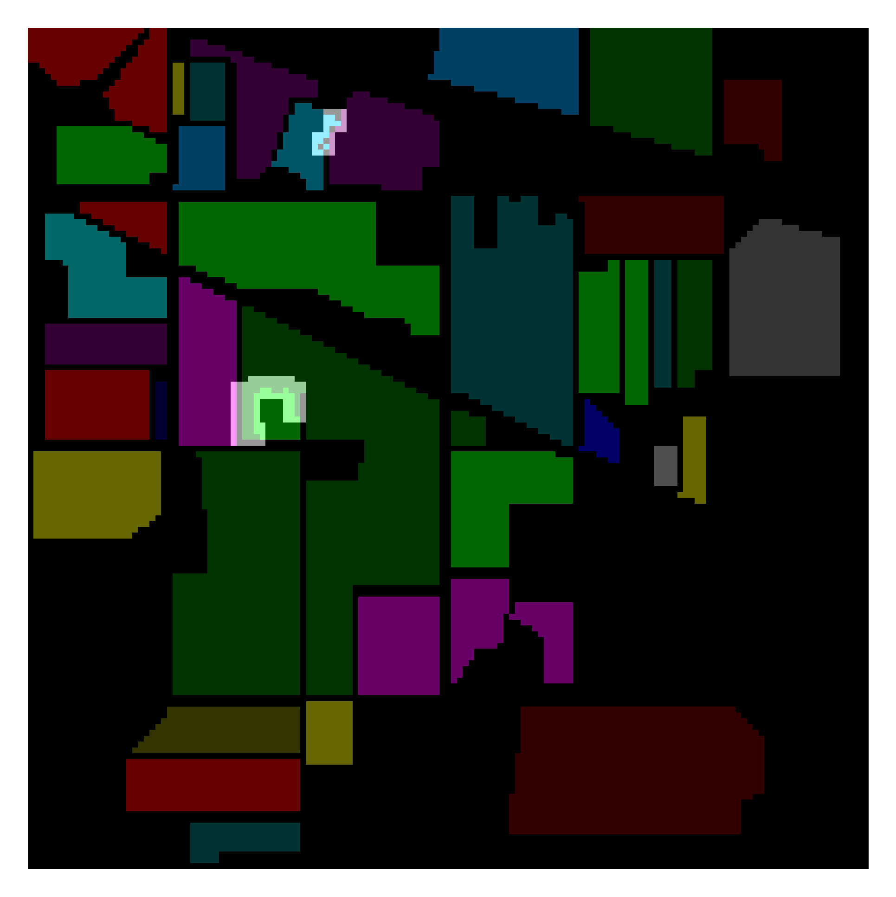
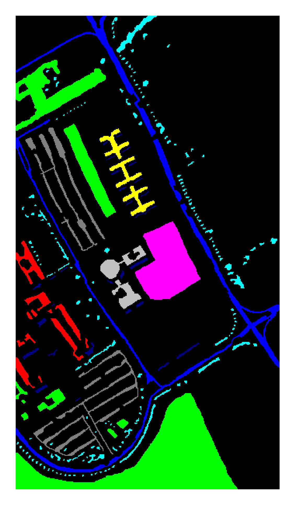
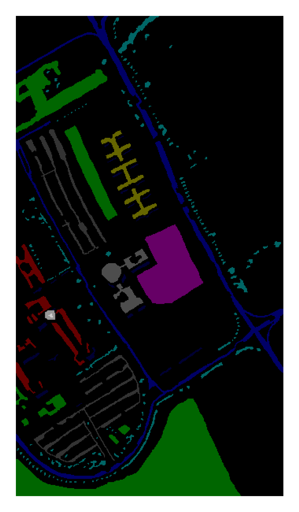
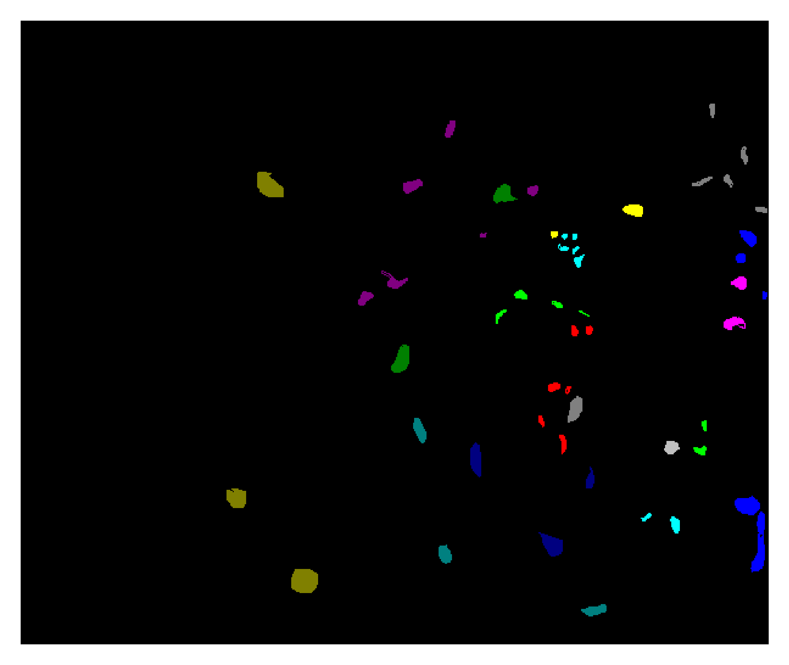
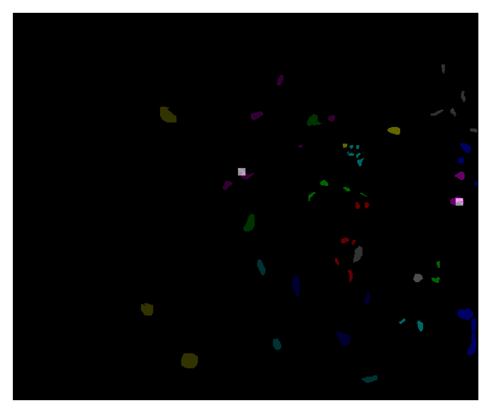
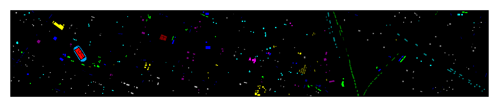

# TripletWatershed_Code

This repository if the official implementation of Triplet-Watershed for Hyperspectral Image Classification. [[HAL]](https://hal.archives-ouvertes.fr/hal-03171597v3/document) [[arXiv]](https://arxiv.org/pdf/2103.09384.pdf).

> Abstract:
Hyperspectral images (HSI) consist of rich spatial and spectral information, which can potentially be used for several applications. However, noise, band correlations and high dimensionality restrict the applicability of such data. This is recently addressed using creative deep learning network archi- tectures such as ResNet, SSRN, and A2S2K. However, the last layer, i.e the classification layer, remains unchanged and is taken to be the softmax classifier. In this article, we propose to use a watershed classifier. Watershed classifier extends the watershed operator from Mathematical Morphology for classification. In its vanilla form, the watershed classifier does not have any trainable parameters. In this article, we propose a novel approach to train deep learning networks to obtain representations suitable for the watershed classifier. The watershed classifier exploits the connectivity patterns, a characteristic of HSI datasets, for better inference. We show that exploiting such characteristics allows the Triplet-Watershed to achieve state-of-art results in supervised and semi-supervised contexts. These results are validated on Indianpines (IP), University of Pavia (UP), Kennedy Space Center (KSC) and University of Houston (UH) datasets, relying on simple convnet architecture using a quarter of parameters compared to previous state-of-the-art networks.
The source code for reproducing the experiments and sup- plementary material (high resolution images) is available at https://github.com/ac20/TripletWatershed Code.


## Requirements

To install requirements:

```setup
conda env create -f environment.yml
```

## Training

Use `Main.py` for training. Output of `python Main.py -h`.

```
usage: Main.py [-h] [--dataset {indianpines,paviaU,ksc,houston}] [--seed SEED] [--train_size TRAIN_SIZE]
               [--embed_dim EMBED_DIM] [--patch_size PATCH_SIZE] [--semi_supervised]

optional arguments:
  -h, --help            show this help message and exit
  --dataset {indianpines,paviaU,ksc,houston}
                        Dataset to work on. Default:indianpines
  --seed SEED           Set the seed for train/test split of dataset. Default:42
  --train_size TRAIN_SIZE
                        Train Size. Default:0.1
  --embed_dim EMBED_DIM
                        Embedding Dimension. Default:64 
  --patch_size PATCH_SIZE
                        Patch size, Default:64
  --semi_supervised     To use semi-supervised split or not. Default:False
```

Simple example to train on [Indian Pines](http://www.ehu.eus/ccwintco/uploads/6/67/Indian_pines_corrected.mat) dataset.

```
python Main.py --dataset indianpines --seed 42
```

Output files - `./dump/results_006ea0a4.txt`, `./dump/indianpines_006ea0a4.png` and `./dump/weights_model_006ea0a4.pth` will be created. `006ea0a4` is the token generated for this configuration. Sample output of the results:

```
Train    OA : 1.0 
Train    AA : 1.0 
Train Kappa : 1.0 
Test     OA : 0.9992413568873957 
Test     AA : 0.9990659493549783 
Test  Kappa : 0.9991351157339922 
        MAP : 0.9958027753801199 
 Train time : 517.2645268440247 
  Test time : 3.1228127479553223 
```

## Results

Results acheived on using 10% of the data for training. See tables II - V in the article for details.

| Dataset       | OA  | AA | Kappa|
| ------------------ |---------------- | ---------------- | ---------------- | 
| [Indian Pines](http://www.ehu.eus/ccwintco/uploads/6/67/Indian_pines_corrected.mat)   | 99.57 ± 0.0026 | 99.62 ± 0.0029 | 0.9951 ± 0.0030 |
| [University of Pavia](http://www.ehu.eus/ccwintco/uploads/e/ee/PaviaU.mat)   | 99.98 ± 0.001 | 99.97 ± 0.001 | 0.9998 ± 0.001 |
| [Kennedy Space Center](http://www.ehu.es/ccwintco/uploads/2/26/KSC.mat)   | 99.72 ± 0.0023 | 99.62 ± 0.0032 | 0.9969 ± 0.0026 |
| [University of Houston](http://hyperspectral.ee.uh.edu/2egf4tg8hial13gt/2013_DFTC.zip)   | 99.25 ± 0.0039 | 99.32 ± 0.0031 | 0.9919 ± 0.0042 |

Results using Semi-Supervised split - 30 training points per class. See tables VI, VII in the article for details.

| Dataset       | OA  | AA | Kappa|
| ------------------ |---------------- | ---------------- | ---------------- | 
| [Indian Pines](http://www.ehu.eus/ccwintco/uploads/6/67/Indian_pines_corrected.mat)    | 96.74 ± 0.0194 | 98.53 ± 0.0098 | 0.9627 ± 0.0221 |
| [University of Pavia](http://www.ehu.eus/ccwintco/uploads/e/ee/PaviaU.mat)   | 99.20 ± 0.0129 | 98.95 ± 0.0165 | 0.9894 ± 0.0170 |


### Indian Pines

|Ground Truth |Triplet-Watershed Result|
| ------------------ |---------------- |
|| |

### University of Pavia

|Ground Truth |Triplet-Watershed Result|
| ------------------ |---------------- |
| ||

### Kennedy Space Centre

|Ground Truth |Triplet-Watershed Result|
| ------------------ |---------------- |
| ||

### University of Houston

|Ground Truth |
| ------------------ |
| |

|Triplet-Watershed Result |
| ------------------ |
||


